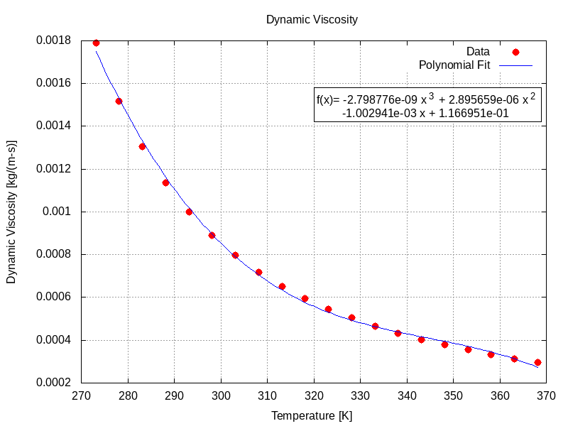
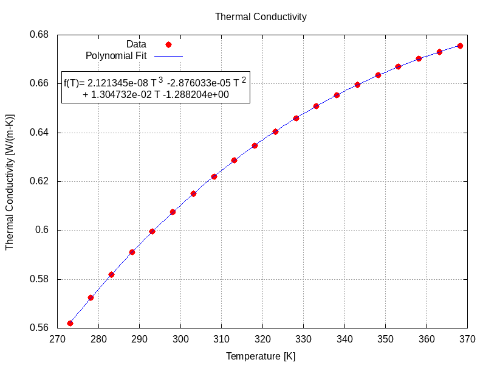
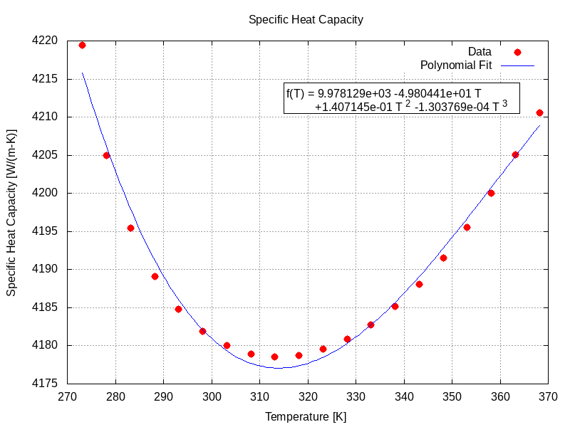
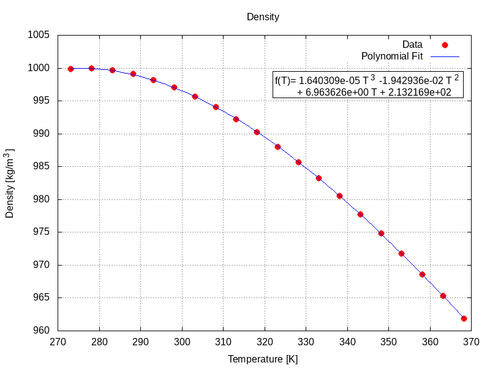

## Introduction

### Purpose

This guide describes a workflow for setting up and executing OpenFOAM studies and uses the simulation of water flow through a header to illustrate the approach. The workflow is comprised of a number of steps discussed individually. The purpose of the study is to evaluate the pressure, the velocity and the temperature patterns developing in the fluid domain for different conditions.

The study consists of two cases `symmetric-velocity-temperature` and `asymmetric-velocity-temperature`. The cases use the same **Geometry** and **Mesh**, but employ different Initial Condition (IC) and Boundary Conditions (BC) for the inlet patches, as presented in the **Model** section.

### Platform

This study is executed on a desktop workstation with the following configuration:
- CPU (*lscpu*): AMD Ryzen 7 1800X Eight-Core Processor
- OS (*uname -a*): Linux nick-AX370-Gaming 5.4.0-26-generic #30-Ubuntu SMP Mon Apr 20 16:58:30 UTC 2020 x86_64 x86_64 x86_64 GNU/Linux
- OpenFOAM: Version 8, Build 8-1c9b5879390b
- Gnuplot (*gnuplot -V*): gnuplot 5.2 patchlevel 8

## Geometry

The geometry generation must create a smooth, clean and watertight geometry. A watertight geometry means a close body with no holes or overlapping surfaces. The mesh quality and, hence the solution quality, depend on the geometry. The geometry should adequately represent the fluid domain. Geometry defeaturing is used to simplify the geometry to retain only the features important for the fluid phenomena under investigation. The solid modeling application used for the geometry generation is [Onshape](https://www.onshape.com). 

The fluid domain is comprised of two inlet pipes, a common header and an outlet pipe. Each inlet pipe is comprised of a cylindrical vertical section and a cylindrical horizontal section. The horizontal section of an inlet pipe is connected to the header at a 90 degrees angle. The header consists of a horizontal pipe section. The outlet pipe consists of a horizontal section connected to the middle of the header at a 90 degrees angle.

The fluid domain geometry is created as a single watertight solid by extruding and sweeping geometry sketches. To facilitate meshing and model development, the solid geometry faces representing patches subsequently used to define fluid boundary conditions (e.g., inlet, outlet) are deleted. After the faces are deleted, the solid geometry becomes a surface geometry. The inlet and outlet patches are recreated as individual surfaces by revolving geometry sketches.

The final fluid domain geometry is comprised of 4 surface objects. The surface objects are exported from Onshape as individual stl files (text format) using the high resolution option. The 4 surface objects, `inlet1.stl`, `inlet2.stl`, `outlet.stl` and `shell.stl`, are saved to the `constant/triSurface` folder. The fluid domain geometry is shown below.

Fluid Domain Geometry and Dimensions [m]              |
:----------------------------------------------------:|
 |

## Mesh

The mesh generation uses `blockMesh` and `snappyHexMesh`.

### blockMesh

`blockMesh` is used to generate the background mesh for `snappyHexMesh`. A quality background mesh is generated when the following criteria are met:
- The background mesh must consist purely of hexahedral cells,
- The cell aspect ratio (i.e. the ratio of the longest to the shortest side of a cell) should be close to 1, at least near the stl surface,
- The cell size shall be sufficiently small to adequately resolve the smallest geometry feature,
- There must be at least one intersection of a cell edge with the stl surface.

`blockMesh` uses the `system/blockMeshDict` dictionary file to generate the mesh. The mesh size is set by variables `xmin`, `xmax`, `ymin`, `ymax`, `zmin` and `zmax` which define a block enclosing the fluid domain geometry. The number of cells along `X`, `Y` and `Z` dimensions is set by variables `xcells`, `ycells` and `zcells` selected such that the criteria above are met. The boundary of the mesh, given in the list named `boundary`, consists of 5 patches `frontandback`, `inlet`, `outlet`, `lowerwall` and, `upperwall`. These patches will be discarded during the mesh generation with `snappyHexMesh` and replaced by the geometry information defined in the `system/snappyHexMeshDict` dictionary file.

In addition to the `system/blockMeshDict` dictionary file, `blockMesh` also requires the `system/controlDict` dictionary file. `blockMesh` is executed in the case folder using:

```
blockMesh | tee log.01.blockMesh
```

`blockMesh` execution generates the background hexahedral mesh in `constant/polyMesh` folder and the log file `log.blockMesh` in the case folder. The mesh information is contained in the `constant/polyMesh/boundary`, `constant/polyMesh/faces`, `constant/polyMesh/neighbour`, `constant/polyMesh/owner` and `constant/polyMesh/points` files.

The `blockMesh` mesh quality is assessed using:

```
checkMesh -allGeometry -allTopology | tee log.02.checkMesh.block
```

### snappyHexMesh

The fluid domain mesh generation with `snappyHexMesh` requires `system/fvSchemes` and `system/fvSolution` dictionary files, which are discussed in the **Solver** section. The mesh generation process is comprised of a number of steps, described below. 

#### Geometry Edge Extraction

The `surfaceFeatures` utility is used to extract the geometry edges and allow for better meshing with `snappyHexMesh` on these edges. The `system/surfaceFeaturesDict` dictionary file lists the geometry surface (stl) files in the `surfaces` list. The edges marked for extraction are those whose adjacent surfaces normal are at an angle less than the angle specified by `includedAngle` in the `system/surfaceFeaturesDict` dictionary file. The `surfaceFeatures` utility is executed in the case folder using:

```
surfaceFeatures | tee log.03.surfaceFeatures
```

The execution of `surfaceFeatures` utility creates the following files for each stl file:
- A `.eMesh` file in the `constant/triSurface` folder,
- A `.extendedFeatureEdgeMesh` and a `_edgeMesh.obj` in the `constant/extendedFeatureEdgeMesh` folder.

#### Mesh Parameters

The `system/snappyHexMeshDict` dictionary file contains the `snappyHexMesh` parameters. The execution of `snappyHexMesh` consists of three steps `castellating`, `snapping` and `layering`. These steps can be enabled or disabled as needed.

The `geometry` dictionary lists the geometry surfaces (stl) files along with their type and name (user defined). The name is used in the **Model** section for IC and BC. A refinement region, `refinementBox`, is also defined.

The `castellatedMeshControls` dictionary controls the parameters for mesh refining in the `castellating` step.

- The `features` dictionary is used for edge refinement of the `*.eMesh` edges to the desired refinement level.

- The `refinementSurfaces` dictionary is used for surface  based  refinement.  For each surface, two refinement levels are defined. The first level is the minimum level that every cell intersecting the surface gets refined up to. The second level is the maximum level of refinement. The `patchInfo` dictionary sets the patch type for each surface. The surface patch type must correspond to the associated BC type defined in the IC and BC dictionary files from the **Model** section.

- The `resolveFeatureAngle` parameter allows edges, whose adjacent surfaces normal are at an angle higher than the value set, to be resolved. A lower value for `resolveFeatureAngle` results in a better resolution at sharp edges.

- The `refinementRegions` dictionary contains the volume  based  refinement parameters for the `shell` region defined in the `geometry` dictionary. The first number of the `levels` parameter represents the distance from the geometry within which all cells are refined while the second number represents the refinement level.

- The `locationInMesh` parameter identifies a location in the final mesh (inside the fluid domain) from which `snappyHexMesh` will mark and keep all connected cells.

The `snapControls` dictionary controls the parameters for refining the mesh in the `snapping` step. This step adapts the castellated mesh to the geometry.

The `addLayersControls` dictionary controls the parameters inserting prismatic cell layers on `shell` surface. The number of layers for the `shell` surface is set by `nSurfaceLayers` to 3. Because the `relativeSizes` is set to `false`, the thickness of the first layer is set by `firstLayerThickness` to 0.004 m. The minimum thickness of any layer is set by `minThickness` to 0.004 m. The increase in size from one layer to the next is set by `expansionRatio` to 1.2.

#### Mesh Quality Parameters

The mesh quality for `snappyHexMesh` is controlled by the entries in the `meshQualityControls` dictionary in the `system/snappyHexMeshDict` dictionary file. The `meshQualityControls` dictionary uses an `include` statement to include the mesh quality parameters defined in the `system/meshQualityDict` dictionary file.

#### Mesh Decomposition

The `decomposePar` utility is used to decompose the mesh into sub-domains, allocated to separate processors, to allow for parallel mesh generation or solver execution. The `system/decomposeParDict` dictionary file contains the `decomposePar` utility parameters. The mesh is decomposed into 8 sub-domains by setting `numberOfSubdomains` to 8. The decomposition method is set to `simple` using the `method` parameter. For the `simple` method, the `n` parameter in the `simpleCoeffs` dictionary decomposes the mesh into 2 sub-domains along the x, y and z directions, respectively. The `decomposePar` utility is executed in the case folder using:

```
decomposePar | tee log.04.decomposePar
```

The execution of `decomposePar` utility creates a `processorX/constant/polyMesh` folder for each processor. The folder contains the sub-domain `blockMesh` mesh assigned to that processor.

#### Mesh Execution

The `snappyHexMesh` is executed in parallel in the case folder using:

```
mpirun -np 8 snappyHexMesh -overwrite -parallel | tee log.05.snappyHexMesh
```

#### Mesh Quality Evaluation

The `snappyHexMesh` mesh quality is assessed using:

```
mpirun -np 8 checkMesh -latestTime -allGeometry -allTopology -parallel | tee log.06.checkMesh.snappy
```

#### Mesh Reconstruction

The `reconstructParMesh` utility reads the sub-domain (processor) `snappyHexMesh` mesh and updates the mesh in the `constant/polyMesh` folder. The `reconstructParMesh` utility is executed in the case folder using:

```
reconstructParMesh -latestTime -constant | tee log.07.reconstructParMesh
```

After the `snappyHexMesh` mesh is reconstructed, the sub-domain (processor) mesh can be removed using:

```
rm -rf processor* > /dev/null 2>&1
```

#### Mesh Optimization

The `renumberMesh` utility is used to reduce bandwidth and speed up computation on the generated mesh. The `renumberMesh` utility is executed in the case folder using:

```
renumberMesh -overwrite | tee log.08.renumberMesh
```

#### Mesh Visualization

The `snappyHexMesh` mesh can be visualized with Paraview using:

```
paraFoam
```

## Model

The study simulates incompressible, nonisothermal, buoyant, turbulent flow of water through a header using the buoyantPimpleFoam OpenFOAM solver. 

### Initial Condition (IC) and Boundary Conditions (BC)

The Initial Condition (IC) and Boundary Conditions (BC) are contained in the `0.orig` folder as individual dictionary files for each field.

#### Velocity

The IC and BC for the velocity field, [m/s], are contained in the `0.orig/U` dictionary file. The fluid domain initial velocity is set by the `internalField` keyword to a uniform value of 0 m/s.

`inlet1` and `inlet2` are defined as patch type `patch` in the `refinementSurfaces` sub-dictionary of `system/snappyHexMeshDict` dictionary file. The boundary condition type is set to `fixedValue` which defines a constant inlet uniform velocity whose magnitude is case specific.

`outlet` is defined as patch type `patch` in the `refinementSurfaces` sub-dictionary of `system/snappyHexMeshDict` dictionary file. The boundary condition type is set to `pressureInletOutletVelocity` which defines a zero-gradient condition for flow out the fluid domain.

`shell` is defined as patch type `wall` in the `refinementSurfaces` sub-dictionary of `system/snappyHexMeshDict` dictionary file. The boundary condition type is set to `fixedValue` of 0 m/s.

#### Pressure

The IC and BC for the pressure field, [Pa], are contained in the `0.orig/p` dictionary file. The fluid domain initial pressure is set by the `internalField` keyword to a uniform value of 0 Pa.

The boundary condition type for `inlet1`, `inlet2` and `shell` is set to `zeroGradient`. The boundary condition type for `outlet` is set to `totalPressure` and the pressure magnitude is set by the `p0` keyword.

#### Pseudo Hydrostatic Pressure

The IC and BC for the pseudo hydrostatic pressure field, [Pa], are contained in the `0.orig/p_rgh` dictionary file. The fluid domain initial pseudo hydrostatic pressure is set by the `internalField` keyword to a uniform value of 0 Pa.

The boundary condition type for `inlet1`, `inlet2` and `shell` is set to `zeroGradient`. The boundary condition type for `outlet` is set to `prghTotalPressure` and the pseudo hydrostatic pressure magnitude is set by the `p0` keyword.

#### Temperature

The IC and BC for the temperature field, [K], are contained in the `0.orig/T` dictionary file. The fluid domain initial temperature is set by the `internalField` keyword to a uniform value of 300 K.

The boundary condition type for `outlet` and `shell` is set to `zeroGradient`. The boundary condition type for `inlet1` and `inlet2` is set to `fixedValue` which defines a constant inlet temperature whose magnitude is case specific.

#### Turbulent Thermal Diffusivity

The IC and BC for the turbulent thermal diffusivity field, [kg/(m-s)], are contained in the `0.orig/alphat` dictionary file. The fluid domain initial turbulent thermal diffusivity is set by the `internalField` keyword to a uniform value of 0 [kg/(m-s)].

The boundary condition type for `inlet1`, `inlet2` and `outlet` is set to `calculated`. The boundary condition type for `shell` is set to `compressible::alphatJayatillekeWallFunction` which provides 
a thermal wall function for turbulent thermal diffusivity based on the Jayatilleke model.


Discuss the `g` file

### Thermophysical Models and Data

The `constant/thermophysicalProperties` dictionary file contains the thermophysical model, the thermophysical submodels and the thermophysical properties data.

#### Thermophysical Models

The thermophysical model is contained in the `thermoType` dictionary. The thermophysical model is defined by setting the `type` to `heRhoThermo`. The `heRhoThermo` thermophysical model calculations are based on enthalpy and density. The thermophysical submodels are contained in the `thermoType` dictionary.

The mixture submodel, `mixture`, is set to `pureMixture` because the fluid is a single specie (i.e. water).

The transport submodel, `transport`, is set to `polynomial` to allow:
- The calculation of dynamic viscosity, [kg/(m-s)], as function of temperature, [K], based on a polynomial fit,
- The calculation of thermal conductivity, [W/(m-K)], as function of temperature, [K], based on a polynomial fit.

The thermodynamics submodel, `thermo`, is set to `hPolynomial` to allow the calculation of specific heat capacity at constant pressure, [J/(kg-K)], as function of temperature, [K], based on a polynomial fit.

The equation of state submodel, `equationOfState`, is set to `icoPolynomial` (incompressible polynomial equation of state) to allow the calculation of density, [kg/m3], as function of temperature, [K], based on a polynomial fit.

The specie submodel, `specie`, is set to `specie`.

The energy submodel, `energy`, is set to `sensibleEnthalpy` as the energy formulation used in the solver solution.

#### Thermophysical Properties Data

The thermophysical properties data for the thermophysical submodels is contained in the specie dictionary named `water`.

The `specie` sub-dictionary contains the molecular composition for each mixture constituent. As the mixture submodel is set to `pureMixture`, the `specie` dictionary contains only the water molecular weight, `molWeight`, [g/mol].

The `transport` sub-dictionary contains:
- The cubic polynomial fit coefficients for dynamic viscosity, `muCoeffs`, as function of temperature,
- The cubic polynomial fit polynomial fit coefficients for thermal conductivity, `kappaCoeffs`, as function of temperature.

The `thermodynamics` sub-dictionary contains:
- The cubic polynomial fit coefficients for specific heat capacity at constant pressure, `CpCoeffs`, as function of temperature,
- The standard entropy, `Sf`, [J/(kg-K)],
- The heat of formation, `Hf`, [J/kg].

The `equationOfState` sub-dictionary contains the cubic polynomial fit coefficients for density, `rhoCoeffs`, as function of temperature.

The dynamic viscosity, thermal conductivity, specific heat capacity and density as function of temperature are calculated based on the water property data at atmospheric pressure of 101325 Pa and temperature between 0 and 95 degrees C (273.15 and 368.15 degrees K) from [IAPWS R7-97(2012)](http://www.iapws.org/relguide/IF97-Rev.html) contained in the [water property data file](water-properties/water-properties.dat).

A [Gnuplot script](water-properties/water-properties.plt) is used to calculate the polynomial fit coefficients for dynamic viscosity, thermal conductivity, specific heat capacity and density as function of temperature. The [Gnuplot script](water-properties/water-properties.plt) is executed in the `water-properties` folder using:

```
gnuplot water-properties.plt
```
The [Gnuplot script](water-properties/water-properties.plt) execution generates the water property polynomial functions shown below.

Water Property Data and Polynomial Functions  |                                              |
:--------------------------------------------:|:--------------------------------------------:|
 |  |
 |  |

### Turbulence Model

The `constant/momentumTransport` dictionary file uses turbulence modelling based on the Reynolds-averaged stress (RAS) by setting `simulationType` to `RAS`. The `RAS` dictionary is used to select and enable the k-epsilon turbulence model by setting `model` to `kEpsilon` and `turbulence` to `on`, respectively. The k-epsilon model coefficients are printed to the terminal at simulation start by setting `printCoeffs` to `on`.

## Solver

### Runtime Control

The `system/controlDict` dictionary file contains instructions for the case execution.

### Numerical Scheme

The `system/fvSchemes` dictionary file contains instructions for the discretization schemes that are used for the different terms in the equations.

### Solution and Algorithm Control

The `system/fvSolution` dictionary file contains the equation solvers, tolerances and algorithms.  


## Execution

The `0.orig` folder is copied to `0` folder.

## Results

