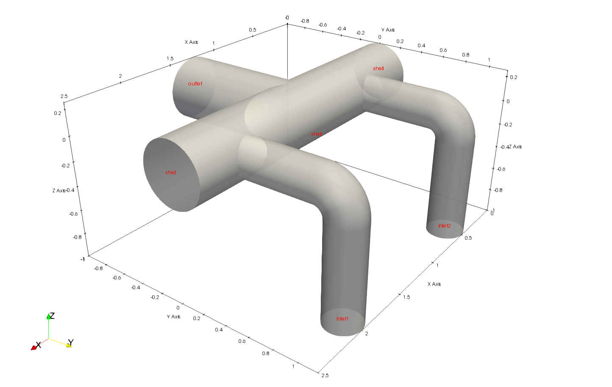

# Simulation of Incompressible, Nonisothermal, Buoyant, Turbulent Flow through a Header using OpenFOAM (buoyantPimpleFoam)

## Introduction

This guide describes a workflow for setting up and executing OpenFOAM studies and uses the simulation of water flow through a header to illustrate the approach. The workflow is comprised of a number of steps discussed individually. The purpose of the study is to evaluate the pressure, the velocity and the temperature patterns developing in the fluid domain for different conditions.

The study consists of two cases `symmetric-velocity-temperature` and `asymmetric-velocity-temperature`. The cases use the same **Geometry** and **Mesh**, but employ different Initial Condition (IC) and Boundary Conditions (BC) for the inlet patches, as presented in the **Model** section.

## Geometry

The geometry generation must create a smooth, clean and watertight geometry. A watertight geometry means a close body with no holes or overlapping surfaces. The mesh quality and, hence the solution quality, depend on the geometry. The geometry should adequately represent the fluid domain. Geometry defeaturing is used to simplify the geometry to retain only the features important for the fluid phenomena under investigation. The solid modeling application used for the geometry generation is [Onshape](https://www.onshape.com). 

The fluid domain is comprised of two inlet pipes, a common header and an outlet pipe. Each inlet pipe is comprised of a cylindrical vertical section and a cylindrical horizontal section. The horizontal section of an inlet pipe is connected to the header at a 90 degrees angle. The header consists of a horizontal pipe section. The outlet pipe consists of a horizontal section connected to the middle of the header at a 90 degrees angle.

The fluid domain geometry is created as a single watertight solid by extruding and sweeping geometry sketches. To facilitate meshing and model development, the solid geometry faces representing patches subsequently used to define fluid boundary conditions (e.g., inlet, outlet) are deleted. After the faces are deleted, the solid geometry becomes a surface geometry. The inlet and outlet patches are recreated as individual surfaces by revolving geometry sketches.

The final fluid domain geometry is comprised of 4 surface objects. The surface objects are exported from Onshape as individual stl files (text format) using the high resolution option. The 4 surface objects, `inlet1.stl`, `inlet2.stl`, `outlet.stl` and `shell.stl`, are saved to the `constant\triSurface` folder. The fluid domain geometry is shown below.

Fluid Domain Geometry and Dimensions                  |
:----------------------------------------------------:|
 |

## Mesh

The mesh generation uses the the `blockMesh` utility and `snappyHexMesh`.

### blockMesh

The `blockMesh` utility is used to generate the background mesh used for `snappyHexMesh`. A quality background mesh is generated when the following criteria is met:
- The background mesh must consist purely of hexahedral cells,
- The hexahedral cell aspect ratio (i.e. the ratio of the longest to the shortest side of a cell) should be approximately 1, at least near the stl surface,
- There must be at least one intersection of a hexahedral cell edge with the stl surface.

Discuss folder prerequisites

Discuss `system/blockMeshDict` dictionary

### snappyHexMesh

## Model

## Solver

## Execution

## Results

